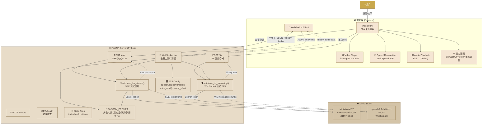
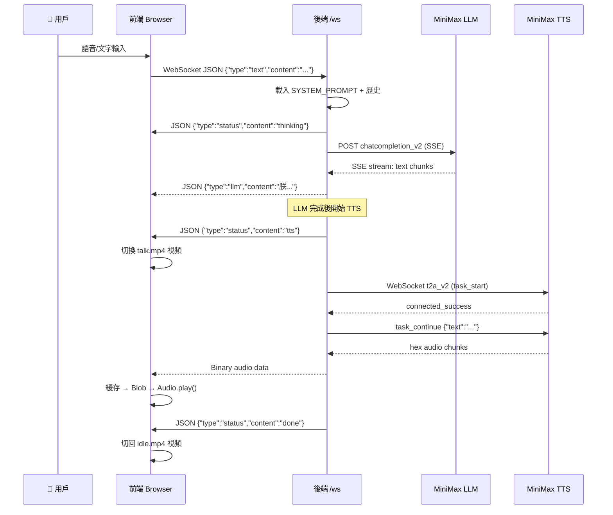
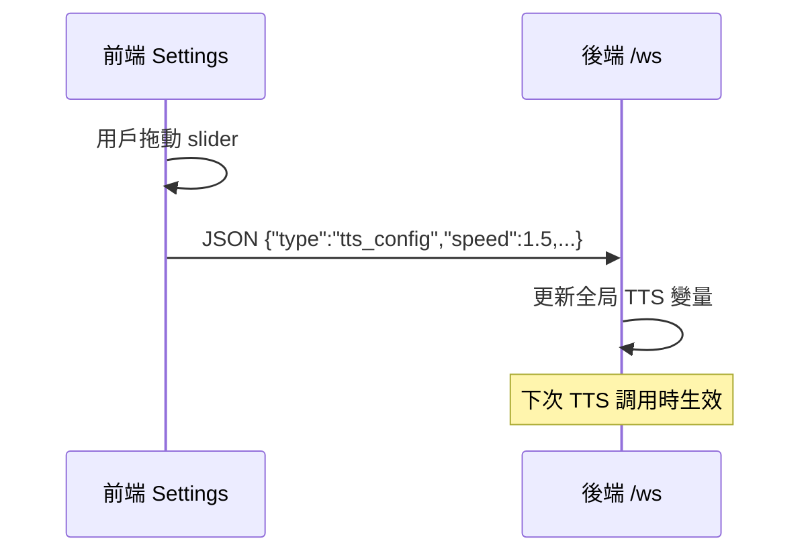
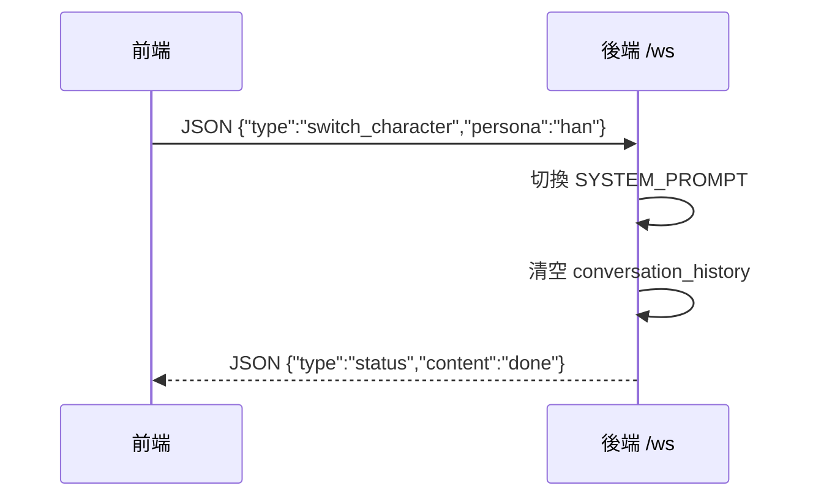

# 秦始皇數字人 — 系統架構

## 通訊流程

### 1. WebSocket 全雙工對話流程

### 2. TTS 配置實時同步

### 3. 角色切換

## 技術棧

| 層 | 技術 |
|---|------|
| 後端框架 | FastAPI (Python) |
| LLM | MiniMax-M2.7 (HTTP SSE Streaming) |
| TTS | MiniMax speech-2.8-hd (WebSocket Streaming) |
| 前端 | Vanilla HTML/CSS/JS (SPA) |
| 語音識別 | Web Speech API (SpeechRecognition) |
| 視頻 | HTML5 Video (idle.mp4 / talk.mp4) |
| 部署 | uvicorn + 4 workers |
